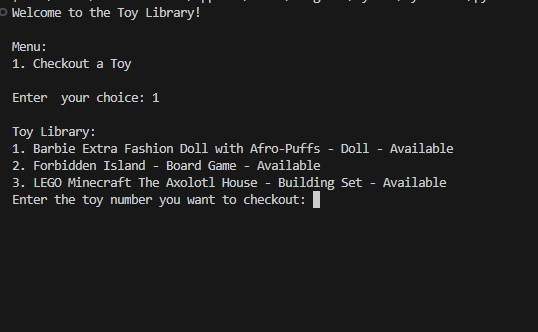
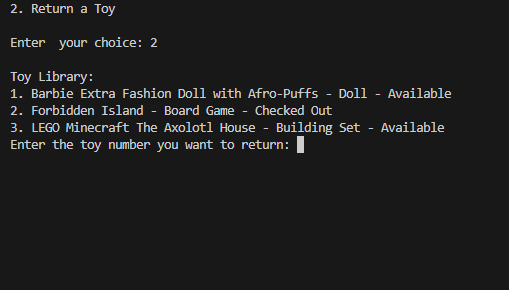
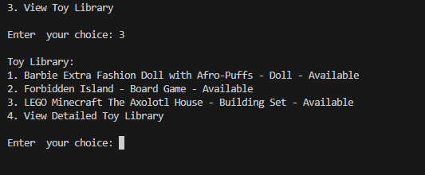
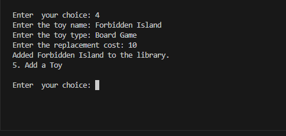
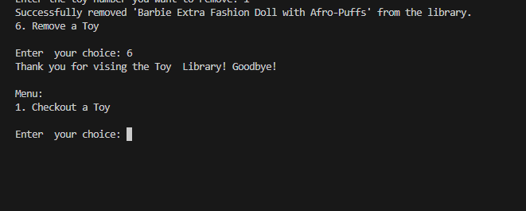

# Toy-Library

## Description

A python based application that allows users to manage a toy library. The toy library provides functionability to add, remove, checkout and return toys, making it easy to keep track of inventory and toy status.

This project was meant to help me practice my python abilities. 

## Table of Contents 

- [Installation](#installation)
- [Usage](#usage)
- [Credits](#credits)
- [License](#license)
- [Feature](#features)
- [ContactMe](#contact-me)

## Installation

Technology required: 

* Python 

Once Python is installed on your local machine, you can clone this repository or download the file. Once you have the file you can use your command line to run the file in your terminal. 

## Usage

Run the following: ' python toy_library.py ' once the file is on your local machine. 
Then follow the prompts to view, add, remove, checkout or return the different toys within the inventory.

## Credits

Credit to:

* Edx Full Stack Bootcamp instructors and TAs for starter code, and guidance. 
* Python Documentation

## License

Licensed under MIT.

Further information on this can be found here: https://choosealicense.com/licenses/mit/

## Features

* Checkout a toy

* Return a toy

* View toys

* Add a toy

* Remove a toy

# Contact Me

| Name          | Email                   | GitHub             | LinkedIn           |
|---------------|-------------------------|--------------------|--------------------|
| Mekenna Baker    | mekenna.drabner@gmail.com | [GitHub Profile](https://github.com/Mekenna-Baker) | [LinkedIn Profile](https://www.linkedin.com/in/mekenna--baker/) |
